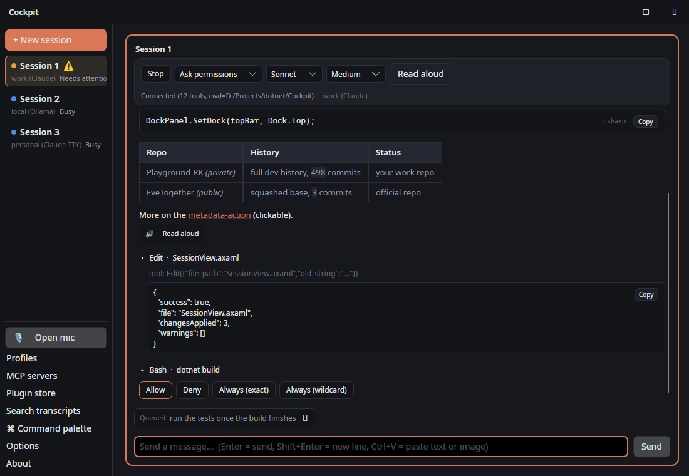
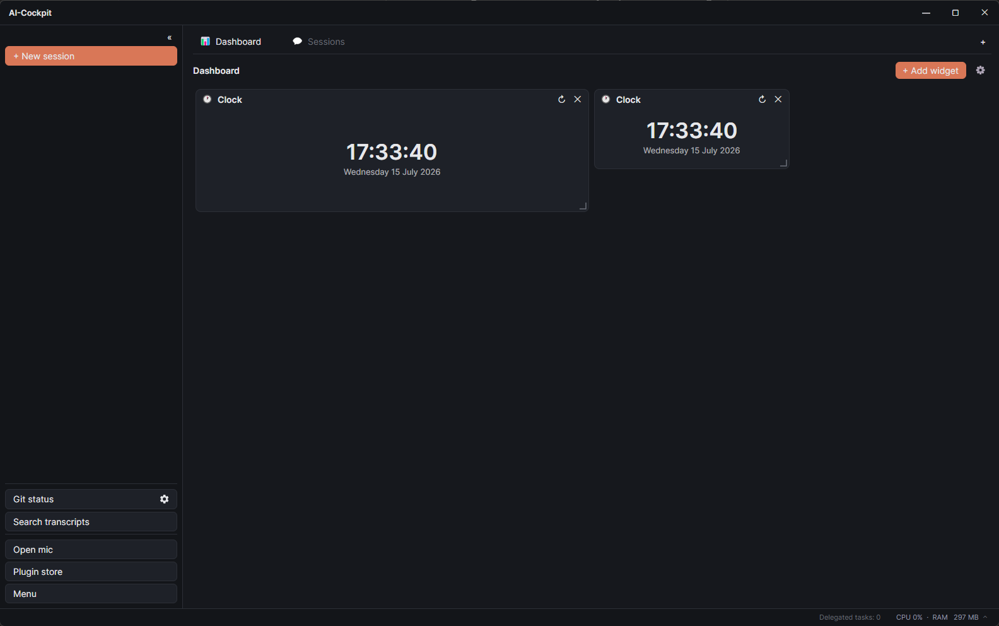
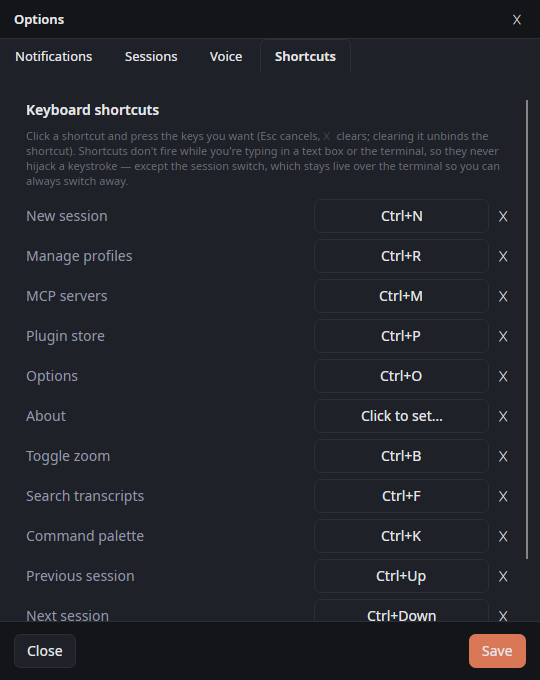

# AI-Cockpit

[](LICENSE)
[](https://dotnet.microsoft.com/)
[](https://avaloniaui.net/)

**Run several AI coding sessions side by side, in one window.** Each session runs under its own profile — and
with it its own provider, model, permission mode and transcript. Claude Code, a local Ollama or LM Studio model,
or a provider added by a plugin: they all run as panes in the same cockpit.



> **Status: 0.3.0, pre-1.0, in active development.** Expect breaking changes between commits; there are no
> releases yet. Deliberately still 0.x: under 1.0 semver promises nothing, which is the honest state of a thing
> whose plugin contract is still moving. Built and tested on Windows and Linux (Fedora).

## Why

Running more than one AI coding agent at once means a terminal per agent. Nothing tells you which one is waiting
for you, which one is still working, and which one finished ten minutes ago — you go and look. Each terminal is
its own island: its own login, its own MCP setup, its own scrollback.

The cockpit makes that one surface. Every session's status (busy / waiting / needs attention / done) is visible
at a glance, a session that needs you raises a toast — or pings you on Discord when you are away from the machine
— and switching between sessions is a keystroke. Profiles, MCP servers, permissions and shortcuts are configured
once and apply to whichever provider you start a session on.

## Providers

A profile's provider is chosen when the profile is created and fixed from then on, so the session UI renders
exactly the controls that provider supports — and no dead ones.

| Provider | Kind | Session modes | Notes |
|---|---|---|---|
| **Claude Code** (`claude` CLI) | built-in | SDK + TTY | Native tools, permission prompts, live model/effort switching |
| **Ollama** | built-in | SDK | Local models over the OpenAI-compatible `/v1` endpoint |
| **LM Studio** | built-in | SDK | Local models over the OpenAI-compatible `/v1` endpoint |
| **Gemini / OpenAI** | plugin | SDK | Both over an OpenAI-compatible chat-completions endpoint |
| **GitHub Models** | plugin | SDK | GitHub's Models API (`models.github.ai/inference`), with a PAT |
| **Codex CLI** | plugin | SDK | Driven as a subprocess per turn (`codex exec --json`, resumed for follow-ups) |

Every provider — built-in or plugin — sits behind one internal session-driver seam and advertises its own
capabilities (tools, permissions, live model switch, vision, ...). Adding another one is a plugin, not a fork:
see the [plugin docs](#documentation).

## How it works

The cockpit does not talk to any model API of its own accord. A session is a driver: it spawns the provider's own
client, or speaks to the provider's own endpoint, under your own login and your own credentials — which the
cockpit never reads, stores or transmits.

**A Claude session** drives the **official Claude Code CLI**. In SDK mode `claude` runs as a headless child
process speaking `stream-json` over stdin/stdout; authentication is whatever your normal `claude /login` produced,
and the cockpit only ever checks that a login exists. Permission prompts work through the CLI's own extension
point: the cockpit registers itself as an MCP `--permission-prompt-tool`, so Claude asks the cockpit before
running a tool, exactly like the interactive CLI would ask in a terminal.

**A local-model or plugin session** speaks that provider's HTTP protocol (or runs its CLI), runs its own tool loop
against the MCP servers you enabled for it, and asks for approval through the same Allow/Deny UI.

### Session modes: SDK and TTY

Two ways to run a Claude session, picked per session in **+ New session** (defaults to TTY; forced to SDK for every
other provider, since only the Claude CLI has an interactive TUI):

- **SDK** — the headless mode: the cockpit parses the event stream and renders its own chat transcript (markdown,
  collapsible tool calls, copyable JSON results, live model/effort switch, Stop-to-interrupt).
- **TTY** — the *real* interactive `claude` terminal UI, embedded via a pseudo-console (ConPTY on Windows,
  `Porta.Pty` cross-platform) and rendered with an adjustable font. No stream-json parsing — you get the actual CLI
  experience inside a cockpit pane.

## MCP

- A **shared MCP-server registry** (Options → MCP servers) holds every configured server, each scoped to **All**
  sessions, **local-only** (Ollama/LM Studio), or **Claude-only**.
- **Per-session selection** — checkboxes in the New-session dialog pick which registered servers a given session
  actually gets.
- Two fan-out paths consume the registry: the **Claude fan-out** (serialized into `--mcp-config`, alongside the
  cockpit's own permission-prompt server), and a **local tool-loop** (a direct MCP client, stdio/HTTP) for
  local-model sessions.
- An **approval gate** wraps every tool the local tool-loop exposes, so a local-model session asks Allow/Deny
  through the same UI Claude's permission prompts use.
- **YouTrack MCP** — the YouTrack plugin registers each configured instance's JetBrains remote MCP endpoint into
  the shared registry automatically, so a session gets YouTrack tools with no manual server setup.

## Delegation — a session handing work to another profile

A running session can hand a task to a *different* profile through the cockpit's own **`cockpit-orchestrator`**
MCP server: an expensive model can pass the mechanical half to a local one, or a Claude session can ask a
Codex profile for a second opinion.

Every profile decides its own terms — whether it is a target at all, what it says it is good for, which work it
accepts, how many tasks at once, and whether it may delegate onwards. The rules live in the engine rather than
in the tool definitions, so they hold however it is reached. A profile that has not opted in is invisible: a
calling agent cannot delegate to what it cannot see.

- **Nothing runs unwatched.** Delegated tasks are listed live in the cockpit, with their output, and you can stop
  any of them. Invisible background agents are exactly what this project does not do.
- **A per-profile task timeout.** A delegated session has nobody watching it, so a model that loops or waits on
  something that never comes would hold the profile's slot and keep drawing on its provider until the app closed.
  A task that outruns its limit is stopped, reported *with the reason*, and its slot handed on.
- **An audit log** beside `cockpit.json` records what was delegated to which profile and how it ended, refusals
  and their reasons included — the task list only lives as long as the app does.

## Voice

- **STT (dictation):** Whisper.net transcription with automatic backend selection — CUDA, then CUDA12, then
  Vulkan, then CPU, honoring an explicit override. The order is per-platform and checked against the natives the
  runtime packages actually carry: **Vulkan is offered on Linux as well as Windows** (it ships `linux-x64`), and
  macOS gets the CPU tail alone, because its GPU path is Metal — which is not a separate runtime at all but rides
  inside the CPU one, already accelerated on Apple Silicon.
- **Nothing GPU-shaped is downloaded until a machine turns out to need it.** The GPU runtimes are fetched on
  first use rather than bundled for every platform, which took a self-contained `win-x64` publish from **1.8 GB to
  294 MB** (measured, both ways, on one machine). The model (`large-v3-turbo`, ~1.6 GB) is fetched on first
  dictation and cached, and unloads again after five minutes with nothing to transcribe — it is 1.5 GB resident,
  which is a lot to hold on a machine also running local models. Build with
  `-p:BundleGpuWhisperRuntimes=false` for a slim CPU-only publish. Details and the measurements:
  [binary size & on-demand runtimes](docs/binary-size-and-on-demand-runtimes.md).
- **Open-mic mode:** continuous listening with Silero VAD-based endpointing (configurable silence timeout) — no
  push-to-talk needed.
- **Push-to-talk:** a configurable key (default `F9`); optionally a **global hotkey** that works even when the
  cockpit isn't focused (a low-level keyboard hook on Windows, the XDG global-shortcuts portal on Wayland/Linux),
  paired with a small **desktop overlay** showing listening/transcribing state and a live waveform.
- **TTS (read-aloud):** replies can be read aloud via sherpa-onnx running **SupertonicTTS** — one multilingual voice
  speaks both Dutch and English, with automatic per-language pronunciation within a single reply, and a choice of
  reading verbatim, rewritten into natural speech, or summarized to the essence.
- All voice features are **opt-in and fully local** — no audio leaves the machine.

## Plugins & plugin store

- Plugins are .NET assemblies loaded from `plugins/` under the config directory, each implementing one interface and
  contributing settings, sidebar buttons/sections, dialogs, **session providers**, **dashboard widgets**, shortcuts
  and/or MCP servers through a host facade.
- **Install from zip**, then **Review & enable**. First load requires explicit **consent** (name/version/author/path/
  hash shown, "runs unsandboxed" warning); the entry assembly's **SHA-256** is pinned, so later tampering re-prompts.
- **Plugin store dialog:** categories, searchable cards, a detail panel with version history and rollback — reusing
  the same download → SHA-256-check → consent → enable pipeline as a manual zip install. A default store is
  pre-seeded ([AI-Cockpit-Plugins](https://github.com/raymondkrahwinkel/AI-Cockpit-Plugins)); add your own under
  Options → Plugins.
- A periodic **update check** raises a toast when a newer version of an installed plugin is available.
- Enabling/disabling/installing a plugin needs a **restart** (a loaded assembly can't be unloaded); a "Restart
  cockpit now" button appears once one is pending. Settings changes do not.

## Workspaces & dashboards



A **workspace** is a named, persisted pane layout, switched from a strip of tabs above the grid. There are two
kinds, and the kind decides what a workspace can hold — so there are no dead controls, and widgets never end up
mixed into a grid of sessions:

- **💬 Sessions** — the work surface: your AI sessions, arranged the way you left them.
- **📊 Dashboard** — a grid of **widgets**, for what you want to glance at rather than talk to.

Tabs are reorderable by dragging and renamable in place; Ctrl+Shift+Left / Ctrl+Shift+Right walk between them.
Closing a workspace with running sessions asks first, and says what it is about to stop. A workspace can override
the global layout choice or follow it, which is its own setting rather than something Options decides for every
desk at once.

Widgets are dragged, dropped and resized freely on the dashboard's grid — drop one on another and they swap;
leave a hole and the next widget you add reuses it. Drag one onto another dashboard's tab and it moves there,
settings and all. Each placed instance keeps its own configuration, so two System Monitors side by side can watch
different things. A dashboard **exports to a file** and imports back, with credentials scrubbed on the way out.

Every widget comes from a plugin — the core owns the grid and the pane chrome and knows nothing about what a
widget shows. Two ship as worked references: **Clock** (with the app) and **System Monitor** (from the store).
See the [design note](docs/workspaces-widgets-terminals.md) and the
[SDK's widget section](docs/plugins/PLUGIN-SDK.md#widget-plugins--a-pane-on-a-dashboard-workspace).

## UI



- **Layout:** adaptive grid, single-session, or stacked-vertically — globally, or overridden per workspace; a
  **draggable sidebar** shows every session's live status, and a **«** collapses it to a slim rail.
- **Transcript:** markdown rendering (headings, syntax-coloured code blocks, tables, lists), tool calls collapse to
  headers with their results underneath, JSON results get a copy button, pasted images drop straight into the
  conversation.
- **Keyboard:** every app action — new session, zoom, transcript search, the command palette (Ctrl+K), switching
  sessions (Ctrl+Up / Ctrl+Down) — is a **rebindable shortcut** in Options → Shortcuts, as are the ones plugins
  contribute. Clearing a gesture unbinds it.
- **Notifications:** an OS toast when you're at the machine, or a **Discord webhook** when you're away (presence from
  idle time + lock state) — fired when a session starts needing attention. A session that has been finished and
  quiet for a while can announce that too, though it is off by default: the interesting moment is usually the
  answer, not the silence after it.
- **What a session is spending:** a TTY session's header shows how full its context window is and how much of the
  five-hour and weekly allowance is gone — three small bars that turn amber past 60% and red past 85%. The numbers
  come from Claude's own statusline, which is the only place the allowances are readable at all; a statusline you
  already configured keeps running underneath.
- **What the cockpit is spending:** it samples its own and each session's process tree, and says so when the total
  gets heavy — pointing at the largest session rather than just the number, because "close something" is only
  useful advice if you know what.
- **Resuming:** a new session can pick up an earlier conversation by id, and a plugin can register a **picker** so
  you search and choose one instead of typing an id.
- **Update check:** the cockpit looks for a newer build on the channel you pick (stable or nightly) and raises a
  toast. A check that could not run says so rather than reporting "up to date", which is a lie you would believe.
- **Transcript search** across sessions (a bundled plugin, not core), an **About** dialog, and minimize-to-tray on
  close.

## Security

Your API keys, MCP bearer tokens and the plugins' tokens live in `cockpit.json`. What the cockpit does about that:

- **Owner-only files.** `cockpit.json` and everything beside it is written `0600`, in a `0700` directory. Nothing
  credential-bearing is left where the umask puts it.
- **Encryption at rest, optional.** Options → Security encrypts every credential in the file (AES-256-GCM) with a
  key derived from a password you set. The cockpit then asks for it at startup. Nothing about that password is
  stored anywhere — which is what makes the file worthless to whoever copies it, and what makes forgetting it
  final. Turning it off is the exact reverse; there is a way back in that clears the credentials and keeps
  everything else.
- **Nothing half-written.** Every save is written whole and renamed into place, keeping the previous version as
  `.bak` — a crash cannot leave you with half a config, and an unreadable one is recovered rather than started
  over empty.
- **Backup and restore.** One zip holds the whole cockpit — settings, profiles, plugins and everything they
  stored — with the credentials **stripped by default**, so a backup is safe to keep where backups get kept
  (include them deliberately if you want them). A restore is destructive and therefore all-or-nothing: the
  archive is read and checked in full before anything is replaced.
- **Where the boundary actually is.** This protects the *file*, not a running cockpit: while it is unlocked the
  credentials are in memory and are handed to the sessions and tool servers that need them, and a plugin you
  installed runs **inside** the app with your rights and can read them. Plugin isolation is a type boundary, not a
  security one. The boundary is the install — which is why the store asks for consent and pins a checksum.
- **Consent for risky actions.** Beyond the install boundary, a shell command, a session hand-off with your
  rights, or arbitrary egress that a plugin or workflow step takes can be gated behind an explicit Approve/Deny
  prompt that shows the **literal action** — and a remembered approval is bound to that exact action from that
  exact source, so it never silently carries to a different action, a different plugin, or a dangerous action. A
  shared host-side facility the workflow and terminal integrations build on.

## Install / run

```
dotnet run --project src/Cockpit.App
```

Or build and launch the produced executable directly — the app is designed to run **detached**, with no attached
console: all logging goes to a file logger rather than stdout.

Create a session via **+ New session**: pick a profile, permission mode, model and effort. Settings live in
**`cockpit.json`** — `%APPDATA%\Cockpit\cockpit.json` on Windows, `~/.config/Cockpit/cockpit.json` on Linux and
macOS. Profiles, layout, voice, shortcuts, always-allow rules, the MCP registry and plugin state all live in that
one file, alongside `plugins/`, `logs/` and the previous version of the config (`cockpit.json.bak`).

Each **Claude** profile can point at its own **`CLAUDE_CONFIG_DIR`** (e.g. a work vs. a personal account), so two
sessions can run under two different logins at the same time.

Every nightly and release ships **one thing per platform, and it is the thing you run** — no unpacking a zip of
loose DLLs and hunting for the executable:

| Platform | Download | Update |
|---|---|---|
| **Windows** | `ai-cockpit-*-win-x64.exe` — a single self-contained file | Overwrite the .exe |
| **macOS** | `ai-cockpit-*-macos-arm64.dmg` — open it, drag the app onto Applications | Replace the app |
| **Linux** | `ai-cockpit-*-x86_64.AppImage` — one file, or the tarball for a server | Overwrite the AppImage |

None of them need a .NET runtime installed, and none of them need an installer. Your settings live in
`cockpit.json` (see below), not next to the binary, so replacing the binary keeps everything.

### Linux

The **AppImage** is one file: make it executable and run it.

```
chmod +x AI-Cockpit-*-x86_64.AppImage
./AI-Cockpit-*-x86_64.AppImage
```

> An AppImage mounts itself with FUSE. On a distribution that ships only fuse3 (most of the recent ones do) you
> either install `libfuse2`, or run it with `--appimage-extract-and-run`, which unpacks to a temp directory and
> needs nothing at all. That is an AppImage thing, not a cockpit thing, and it is worth knowing before you
> conclude the build is broken: without FUSE it exits silently.

Prefer the tarball — for a server, or to feed a package build — and want the app in your application menu?
`scripts/install-linux.sh` publishes the app and adds a desktop entry with its icon. `scripts/package-appimage.sh`
builds the AppImage itself, from a publish directory or from scratch.

### macOS

macOS reads an app's identity from its bundle, so the cockpit ships as a real `.app` rather than a bare
executable (without one the menu bar reads "Avalonia Application" and the microphone permission prompt has
nothing to say):

```
scripts/package-macos.sh arm64 1.0.0        # or: x64
```

That publishes self-contained, assembles `artifacts/macos/AI-Cockpit.app`, stamps the version, builds the icon,
signs the bundle **ad-hoc** — enough to run and to grant microphone access on the machine that built it — and
wraps it in a **`.dmg`** with an Applications shortcut, which is how a macOS app is handed to a person: open,
drag, done. One bundle per architecture: a universal binary means lipo-ing every native library in the publish
output, not just the apphost.

> **Ad-hoc means Gatekeeper will object elsewhere.** A nightly is signed on the runner that built it and nowhere
> near a Developer ID, so on your machine macOS will refuse it until you allow it (right-click → Open, or
> Settings → Privacy & Security). That is not a broken build; it is what an unnotarised app looks like.

For distribution, sign with a Developer ID and notarise (the script prints the exact commands):

```
CODESIGN_IDENTITY="Developer ID Application: … (TEAMID)" scripts/package-macos.sh arm64 1.0.0
```

Signing uses the hardened runtime with `src/Cockpit.App/Cockpit.entitlements` — the .NET JIT entitlements plus
`device.audio-input`, without which macOS refuses to even ask about the microphone. The app is deliberately
**not** sandboxed: it spawns the `claude` CLI and reads each profile's `~/.claude*` config directory.

> The bundle uses the generic icon until `src/Cockpit.App/Assets/AppIcon.png` (1024×1024) exists — the script
> says so rather than shipping a bundle that points at an icon that is not there.

### Requirements

| Requirement | When |
|---|---|
| **.NET SDK 10.0+** | always |
| **Claude Code CLI** (`claude`), installed and logged in | only for Claude profiles |
| **Ollama** or **LM Studio** running locally | only for those profiles |
| An API key / PAT | only for the plugin providers that need one (Gemini, OpenAI, GitHub Models) |

You do **not** need a Claude subscription to use the cockpit — a local Ollama profile works on its own.

For UI development there is a headless verification mode that renders a window off-screen and writes a PNG (no
display needed) — the screenshots in this README are produced by it:

```
dotnet run --project src/Cockpit.App -- --screenshot out.png --scene session
```

Tests:

```
dotnet test
```

## Documentation

- **[Workspaces, dashboards & widgets](docs/workspaces-widgets-terminals.md)** — the design note behind the
  workspace strip, the two workspace kinds, the dashboard grid and where widgets come from.
- **[Binary size & on-demand runtimes](docs/binary-size-and-on-demand-runtimes.md)** — why the publish is 294 MB
  instead of 1.8 GB, what is fetched when, and the measurements behind both.
- **[Plugin SDK guide](docs/plugins/PLUGIN-SDK.md)** — build a plugin: settings, sidebar, dialogs, session providers,
  dashboard widgets, shortcuts, MCP registration, packaging, install, and publishing your own plugin store.
- **[Plugin API reference](docs/plugins/API-REFERENCE.md)** — every method a plugin can call (`ICockpitHost`,
  `ICockpitActions`, `IPluginStorage`, `IPluginSettingsView`, the `Sessions` and `Mcp` namespaces), with signatures,
  parameters and short examples.
- **[Example store index](docs/plugins/example-store-index.json)** — a template for your own store's `index.json`.
- **Official plugin store:**
  [github.com/raymondkrahwinkel/AI-Cockpit-Plugins](https://github.com/raymondkrahwinkel/AI-Cockpit-Plugins) — the
  [`plugins-dev/`](plugins-dev) example plugins, published. UI plugins (GitHub Issues, GitHub Pull Requests,
  YouTrack, Git Status, Prompt Library, Transcript Search), widgets (Clock, System Monitor), providers
  (Gemini/OpenAI, GitHub Models, CLI Agent/Codex) and **Workflows** — a canvas where flows are drawn and an
  engine that runs them, which other plugins contribute their own steps and triggers to.
- **Scaffold a new plugin:** `dotnet new install ./templates/cockpit-plugin` then
  `dotnet new cockpit-plugin -n My.Plugin -o plugins-dev/My.Plugin`.

## How this project is built

This project is developed in an **AI-assisted workflow** — fittingly, since it is itself a tool for working with AI
agents. The direction, architecture decisions, feature choices and acceptance testing are human; the majority of the
implementation is written by AI agents orchestrated through Claude Code by the maintainer.

That workflow does not lower the bar — it *is* the bar this tool exists to support:

- every change is reviewed, must build with **zero warnings**, and ships with unit tests (xUnit; 1400+ and counting);
- UI changes are verified visually against rendered screenshots before they land;
- features that touch a real CLI are verified end-to-end against a live process, not assumed from documentation;
- the maintainer signs off on every commit and takes full responsibility for the result.

If you find something that looks generated-and-unread, that is a bug in the process — please open an issue.

## Disclaimer

AI-Cockpit is an independent open-source project. It is **not affiliated with, endorsed by, or sponsored by**
Anthropic, OpenAI, Google, GitHub or any other provider. "Claude" and "Claude Code" are trademarks of Anthropic, PBC;
other names are the trademarks of their respective owners.

The cockpit launches each provider's own client under **your own login and subscription**; your use of a provider
through this tool is governed by your own agreement with that provider. The tool is **single-user by design**: a local
desktop app for driving your own sessions, not a service, proxy or account-sharing layer.

## Support

- **Found a bug or have a feature request?** [Open an issue](https://github.com/raymondkrahwinkel/AI-Cockpit/issues).
- **Security issue?** Don't open a public issue — follow [`SECURITY.md`](SECURITY.md) to report it privately.

## Contributing

Contributions are welcome, but the bar is high for a one-person project. **Read
[`CONTRIBUTING.md`](CONTRIBUTING.md) before opening a pull request.** By participating you agree to the
[Code of Conduct](CODE_OF_CONDUCT.md).

## Licence

AI-Cockpit is licensed under the **Apache License 2.0 with the Commons Clause** — you may use, modify and self-host it,
but you may not sell it — see [`LICENSE`](LICENSE). Copyright © 2026 Raymond Krahwinkel / Krahwinkel-IT.

The plugin SDK — the `Cockpit.Plugins.Abstractions` project — is licensed separately under the **MIT License** with no
Commons Clause, so anyone may build, distribute and sell plugins that depend on it. See
[`src/Cockpit.Plugins.Abstractions/LICENSE`](src/Cockpit.Plugins.Abstractions/LICENSE).

### Third-party model licences

Voice models are downloaded on first use and are **not** covered by AI-Cockpit's own licence:

- **SupertonicTTS** read-aloud weights (`sherpa-onnx-supertonic-3-tts-int8-*`) are released under the
  **OpenRAIL-M License**. Commercial use is permitted **with attribution** and subject to the licence's
  use-restrictions — read them before any commercial release. The sherpa-onnx runtime itself is Apache-2.0.
- **Whisper** (dictation) ggml models and the **Whisper.net** runtime carry their own upstream licences.

See [`NOTICE`](NOTICE) for the full third-party attribution list (models, runtimes and libraries).
